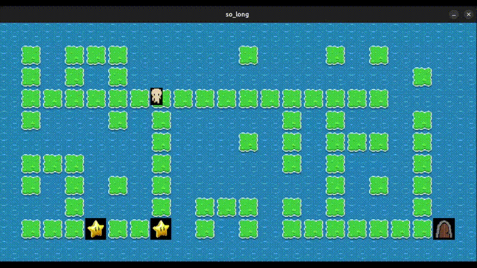

# 🎮 So Long - 2D Maze Game

[](https://42.fr)
[](https://www.cprogramming.com/)
[](https://github.com/42Paris/minilibx-42)

A 2D top-down maze game built in C using the MinilibX graphics library. Navigate through mazes, collect all items, and reach the exit to win!

## 🎥 Demo



## 📋 Table of Contents

- [🎮 Game Overview](#-game-overview)
- [🚀 Features](#-features)
- [🗺️ Map Format](#️-map-format)
- [⚡ Quick Start](#-quick-start)
- [🛠️ Installation](#️-installation)
- [🎯 Usage](#-usage)
- [🏗️ Project Structure](#️-project-structure)
- [🔧 Technical Details](#-technical-details)
- [🎨 Graphics](#-graphics)
- [🐛 Error Handling](#-error-handling)
- [📝 42 School Requirements](#-42-school-requirements)

## 🎮 Game Overview

**So Long** is a 2D maze game where you control a character that must:
- **Navigate** through maze-like maps
- **Collect** all items (⭐) before reaching the exit
- **Reach** the exit (🚪) to win the game
- **Avoid** walls and obstacles

### Game Elements
- `P` - Player (you!)
- `C` - Collectible items (⭐)
- `E` - Exit door (🚪)
- `1` - Walls (impassable)
- `0` - Empty space (walkable)

## 🚀 Features

### Core Gameplay
- **Smooth 4-directional movement** with WASD keys
- **Real-time move counter** displayed on screen
- **Collision detection** preventing wall traversal
- **Collectible system** - must gather all items before winning
- **Win condition** - reach exit after collecting all items
- **Player animations** - different sprites for each direction

### Map Validation
- **File format validation** - must be `.ber` files
- **Rectangular shape** - all rows must have equal length
- **Minimum size** - at least 3x3 tiles
- **Walled perimeter** - map must be completely surrounded by walls
- **Valid elements** - exactly one player, one exit, and at least one collectible
- **Path validation** - flood fill algorithm ensures all collectibles and exit are reachable

### Graphics & UI
- **XPM sprite system** with custom pixel art
- **Smooth rendering** with MinilibX graphics library
- **Real-time updates** with efficient memory management
- **Clean visual design** with consistent 50x50 pixel tiles

## 🗺️ Map Format

Maps are stored in `.ber` files with the following character mapping:

```
1 - Wall (impassable)
0 - Empty space (walkable)
P - Player starting position
C - Collectible item
E - Exit
```

### Example Map:
```
1111111111111
1001000000001
1000011111001
1P0011E0000C1
1111111111111
```

## ⚡ Quick Start

```bash
# Clone the repository
git clone https://github.com/mhmdam14/so_long
cd so_long

# Compile the project
make

# Run the game with a map
./so_long maps/map.ber
```

## 🛠️ Installation

### Prerequisites
- **GCC compiler** (GNU Compiler Collection)
- **Make** build system
- **X11 development libraries** (for Linux)
- **MinilibX library** (included in project)

### Compilation Commands
```bash
# Compile the project
make

# Clean object files
make clean

# Clean everything including executable
make fclean

# Recompile everything
make re
```

## 🎯 Usage

### Controls
- **W** - Move up
- **A** - Move left  
- **S** - Move down
- **D** - Move right
- **ESC** - Exit game

### Available Maps
The project includes several pre-made maps with increasing difficulty:

| Map | Size | Collectibles | Difficulty |
|-----|------|--------------|------------|
| `map.ber` | 5×13 | 1 | Tutorial |
| `map1.ber` | 7×32 | 2 | Easy |
| `map2.ber` | 12×21 | 3 | Medium |
| `map3.ber` | 11×24 | 4 | Hard |
| `map4.ber` | 8×46 | 5 | Expert |

### Running Different Maps
```bash
./so_long maps/map1.ber    # Easy map
./so_long maps/map2.ber    # Medium map
./so_long maps/map3.ber    # Hard map
./so_long maps/map4.ber    # Expert map
```

## 🏗️ Project Structure

```
so_long/
├── 📁 Core Files
│   ├── so_long.c          # Main program entry point
│   ├── so_long.h          # Header with structures and declarations
│   ├── checker.c          # Map validation functions
│   ├── generate_map.c     # Map parsing and loading
│   └── validate_path.c    # Path validation using flood fill
│
├── 🎮 Game Logic
│   ├── movement.c         # Player movement and collision detection
│   ├── keyhook.c          # Keyboard input handling
│   └── print.c           # Graphics rendering and display
│
├── 🛠️ Utilities
│   ├── file_to_image.c    # XPM image loading
│   ├── errors.c          # Error handling and messages
│   ├── end.c             # Program cleanup and exit
│   └── free_allocations.c # Memory management
│
├── 📚 Libraries
│   ├── libft/            # Custom C library functions
│   └── minilibx-linux/   # Graphics library
│
├── 🗺️ Game Content
│   ├── maps/             # Game maps (.ber files)
│   └── Textures/         # XPM sprite files
│
└── 🛠️ Build System
    └── Makefile          # Build configuration
```

## 🔧 Technical Details

### Data Structures

```c
typedef struct s_player {
    int y;    // Player Y position
    int x;    // Player X position
} t_player;

typedef struct s_image {
    void *empty;           // Empty space sprite
    void *exit;            // Exit door sprite
    void *collectible;     // Collectible item sprite
    void *wall;            // Wall sprite
    void *player_left1;    // Player facing left
    void *player_right1;   // Player facing right
    void *player_up1;      // Player facing up
    void *player_down1;    // Player facing down
} t_image;

typedef struct s_map {
    // Map data
    char **arr;            // Main map array
    char **arr_copy;       // Copy for path validation
    int y, x;              // Map dimensions
    
    // Game state
    int moves;             // Move counter
    int c, e, p;           // Count of collectibles, exits, players
    
    // Graphics
    void *minilibx;        // MLX instance
    void *window;          // Game window
    t_image image;         // Sprite images
    t_player player;       // Player data
} t_map;
```

### Key Algorithms

1. **Flood Fill Path Validation**
   - Ensures all collectibles and exit are reachable
   - Uses recursive algorithm to mark accessible areas
   - Prevents unsolvable maps

2. **Map Parsing & Validation**
   - Reads `.ber` files line by line
   - Validates map structure and elements
   - Checks for rectangular shape and walled perimeter

3. **Collision Detection**
   - Prevents movement through walls
   - Blocks exit access until all collectibles are gathered
   - Handles boundary checking

4. **Memory Management**
   - Proper allocation and deallocation of resources
   - Cleanup on program exit
   - No memory leaks

## 🎨 Graphics

The game uses custom XPM pixel art sprites:

| Element | File | Description |
|---------|------|-------------|
| Empty Space | `empty.xpm` | Background tile |
| Wall | `wall.xpm` | Impassable barrier |
| Exit | `door.xpm` | Goal destination |
| Collectible | `Estrellita.xpm` | Star-shaped item |
| Player (Up) | `up-1-40.xpm` | Character facing up |
| Player (Down) | `down-1-40.xpm` | Character facing down |
| Player (Left) | `left-1-40.xpm` | Character facing left |
| Player (Right) | `right-1-40.xpm` | Character facing right |

### Rendering System
- **50x50 pixel tiles** for consistent sizing
- **Real-time sprite updates** based on movement direction
- **Efficient image loading** with MinilibX
- **Smooth visual transitions** between game states

## 🐛 Error Handling

The program includes comprehensive error handling for:

### Map Validation Errors
- ❌ Invalid file extension (must be `.ber`)
- ❌ File not found or unreadable
- ❌ Non-rectangular map shape
- ❌ Missing or invalid map elements
- ❌ Unreachable collectibles or exit
- ❌ Map too small (< 3x3)

### Runtime Errors
- ❌ Memory allocation failures
- ❌ Graphics initialization errors
- ❌ Image loading failures
- ❌ Window creation failures

### User Input Errors
- ❌ Incorrect number of arguments
- ❌ Invalid map file path

## 📝 42 School Requirements

This project meets all 42 school curriculum requirements:

### ✅ Code Quality
- **Norm-compliant** C code following 42 standards
- **Clean architecture** with modular design
- **Proper header management** with include guards
- **Consistent coding style** throughout

### ✅ Memory Management
- **No memory leaks** - all allocations properly freed
- **Efficient memory usage** with minimal overhead
- **Proper cleanup** on program exit
- **Safe pointer handling** with null checks

### ✅ Error Handling
- **Comprehensive validation** of all inputs
- **Graceful error recovery** where possible
- **Clear error messages** for debugging
- **Proper exit codes** for different error types

### ✅ Performance
- **Efficient algorithms** for path validation
- **Optimized rendering** with minimal redraws
- **Fast map parsing** with linear time complexity
- **Responsive controls** with immediate feedback

### ✅ Documentation
- **Clear function documentation** in header files
- **Comprehensive README** with usage instructions
- **Code comments** explaining complex logic
- **Project structure** clearly organized

## 🤝 Contributing

This is a 42 school project, but suggestions and improvements are welcome! Feel free to:
- Report bugs or issues
- Suggest new features
- Improve documentation
- Optimize performance


---

**👨‍💻 Author**: mal-moha  
**🏫 School**: 42  
**📅 Project**: so_long  

